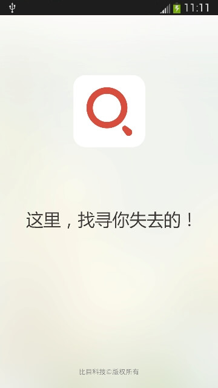
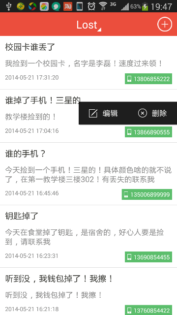
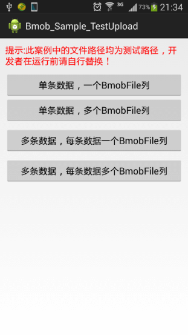
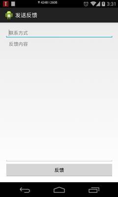
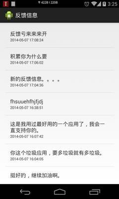

## 失物招领案例教程

### 需求描述

为演示Bmob提供的云数据库的功能，本文制作了一个失物招领的简单案例，实现物品的发布、修改、呈现和删除，展示如何使用Bmob快速开发一个有后端数据库的应用软件。使用场景如下：用户捡到物品，打开手机软件，填写物品的招领信息（标题、描述和联系方式）；用户丢失物品，打开手机软件，填写物品的丢失信息（标题、描述和联系方式）；任何人都可以查看到失物和招领的信息列表，可以对发布的信息进行删除。

**说明一点的是，因为是演示案例，所以信息的添加和删除并没有进行用户身份验证。**

本案例将使用到Bmob的如下功能：

1.添加数据

添加失物/招领信息到服务器中。

2.查找数据

在列表中显示所有用户发布的失物/招领信息。

3.删除数据

删除已发布的失物/招领信息。

本案例最终实现的部分界面效果如下：

 

失物招领软件闪图

 

 招领列表页


 

 失物编辑删除功能
 
 

 添加失物信息

### 数据结构设计

本案例的数据结构非常简单，只需要设计两个表，一个是失物表（Lost表），一个是招领表（Found表），对应的数据结构如下（省略对常用默认字段objectId、createAt、updateAt的描述，对于还不知道怎么创建应用和添加数据表的开发朋友请先移步[快速入门指南](http://docs.bmob.cn/data/Android/a_faststart/doc/index.html "快速入门指南")查看相关教程）：

失物表（Lost）

|字段名|类型|描述|
|:---|:---|:---|
|describe|String|失物的描述信息|
|phone|String|联系的手机号码|
|title|String|失物的标题信息|


招领表（Found）

|字段名|类型|描述|
|:---|:---|:---|
|describe|String|招领的描述信息|
|phone|String|联系的手机号码|
|title|String|招领的标题信息|

### 初始化SDK

Bmob为每个应用都提供了一个唯一标识（对应为开发者后台应用中的“应用密钥->Application ID”），使用Bmob开发的应用都要首先使用这个Application ID”进行初始化。对应代码如下（详细代码实现参看BaseActivity类）：

```java
protected void onCreate(Bundle savedInstanceState) {
	super.onCreate(savedInstanceState);
	//初始化 Bmob SDK，第一个参数为上下文，第二个参数为Application ID
	Bmob.initialize(this, Constants.Bmob_APPID);
	//其他代码
}
```

### 创建数据模型类

为操作Bmob的云端数据库，SDK首先需要创建数据表对应的模型类（模型类的名称必须和云端数据表的名称一致），该类需要继承自BmobObject，实现刚刚创建的数据表字段的set和get方法（系统默认字段objectId、createAt、updateAt不需要声明）。因为本案例需要操作Lost表和Found表，因此需要创建Lost类和Found类。下面是Lost模型类的实现代码（Found模型类的实现代码略）：

```java
public class Lost extends BmobObject{

	private String title;//标题
	private String describe;//描述
	private String phone;//联系手机
	public String getTitle() {
		return title;
	}
	public void setTitle(String title) {
		this.title = title;
	}
	public String getDescribe() {
		return describe;
	}
	public void setDescribe(String describe) {
		this.describe = describe;
	}
	public String getPhone() {
		return phone;
	}
	public void setPhone(String phone) {
		this.phone = phone;
	}
}

```

### 添加失物及招领信息

用户填写了失物信息之后，只需要构造一个Lost实例，然后简单调用模型类的insertObject方法（第一个参数是上下文，第二个参数是插入信息的回调类）就可以将信息添加到云数据库中，实现代码如下（详细代码实现参看AddActivity类）：

```java
		Lost lost = new Lost();
		lost.setDescribe(describe);
		lost.setPhone(photo);
		lost.setTitle(title);
		lost.save(this, new SaveListener() {
			
			@Override
			public void onSuccess() {
				ShowToast("失物信息添加成功!");
				//其他代码
			}
			
			@Override
			public void onFailure(int code, String arg0) {
				ShowToast("添加失败:"+arg0);
			}
		});
```

### 获取失物及招领列表

Bmob提供了复杂和简单的查询方法，可以对查询结果进行排序，可以对结果进行缓存。本案例只使用到Bmob提供的最简单的查询和排序功能，直接调用BmobQuery类的findObjects方法和order方法来获取失物列表，实现代码如下（详细代码实现参看MainActivity类）：

```java
		BmobQuery<Lost> query = new BmobQuery<Lost>();
		//按照时间降序
		query.order("-createdAt");
		//执行查询，第一个参数为上下文，第二个参数为查找的回调
		query.findObjects(this, new FindListener<Lost>() {

			@Override
			public void onSuccess(List<Lost> losts) {
                .....
				//将结果显示在列表中
				LostAdapter.addAll(losts);
				.....
			}

			@Override
			public void onError(int code, String arg0) {
				showErrorView(0);
			}
		});
```

### 删除失物及招领信息

Bmob云数据库对每条新增的数据都有一个唯一标识（objectId），这类似于传统SQL数据库中的唯一主键的性质。从云数据库中删除某条记录需要设置这个要删除的ObjectId的信息，再调用模型类的deleteObject方法就可以了，实现代码如下（详细代码实现参看MainActivity类的deleteLost方法）：

```java
		Lost lost = new Lost();
		//设置ObjectId信息
		lost.setObjectId(LostAdapter.getItem(position).getObjectId());
		//执行删除方法，第一个参数为上下文，第二个参数为删除的回调
		lost.delete(this, new DeleteListener() {

			@Override
			public void onSuccess() {
				//删除成功
				LostAdapter.remove(position);
			}

			@Override
			public void onFailure(int code, String arg0) {
				//删除失败
			}
		});
```

### 后记

本案例只是演示如何用Bmob进行快速的数据增删改查，在真实的应用环境下，你还可能还需要使用到用户系统、文件服务、更复杂的数据结构和服务，这些都可以使用Bmob就可以实现。如果想要获取更多的信息，请各位查看Bmob的[开发文档](http://docs.bmob.cn/data/Android/b_developdoc/doc/index.html "开发文档")或者联系技术客服。欢迎砸砖，欢迎提出更多的意见和建议帮助Bmob更好的发展。谢谢～

### 案例下载

[失物招领案例下载](https://github.com/bmob/bmob-app-demo-show/blob/master/download/Bmob_Sample_lost_found.zip "失物招领案例下载")

## 上传文件案例教程

### 上传文件需求描述

相对于移动网络和数据服务而言，文件服务往往需要更长的i/o时间，因此也就涉及到更多的异步操作的问题。不少朋友在用到Bmob文件服务的时候出错，原因就是没有充分理解同步和异步的本质。为方便大家理解Bmob的文件服务，这里提供一个上传文件的案例，从如何往一个只有一列文件字段的表中插入一条或者多条，到如何往一个有两列甚至多列文件字段的表中插入一条或者多条数据进行详细阐述。

案例的界面效果如下：

 

### 上传文件数据结构设计

本案例的数据结构非常简单，只需要设计两个表，一个是电影表（Movie表，只有一个File字段），一个是音乐表（Music表，有两个File字段），对应的数据结构如下（省略对常用默认字段objectId、createAt、updateAt的描述，对于还不知道怎么创建应用和添加数据表的开发朋友请先移步[快速入门指南](http://docs.bmob.cn/data/Android/a_faststart/doc/index.html "快速入门指南")查看相关教程）：

电影表（Movie表）

|字段名|类型|描述|
|:---|:---|:---|
|name|String|电影名称|
|file|File|电影文件|


音乐表（Music表）

|字段名|类型|描述|
|:---|:---|:---|
|name|String|歌曲名称|
|artist|String	|艺术家|
|mp3|File|mp3文件|
|lrc|File|歌词文件|

### 安装和初始化SDK

Bmob为每个应用都提供了一个唯一标识（对应为开发者后台应用中的“应用密钥->Application ID”），使用Bmob开发的应用都要首先使用这个Application ID”进行初始化。对应代码如下（详细代码实现参看BaseActivity类，PS：大家可以顺便体会下创建BaseActivity类的好处^_^）：

```java
protected void onCreate(Bundle savedInstanceState) {
	super.onCreate(savedInstanceState);
	//初始化 Bmob SDK，第一个参数为上下文，第二个参数为Application ID
	Bmob.initialize(this, Constants.Bmob_APPID);
	//其他代码
}
```

### 创建模型类文件

为操作Bmob的云端数据库，SDK首先需要创建数据表对应的模型类（模型类的名称必须和云端数据表的名称一致），该类需要继承自BmobObject，实现刚刚创建的数据表字段的set和get方法（系统默认字段objectId、createAt、updateAt不需要声明）。因为本案例需要操作Movie表和Music表，因此需要创建Movie类和Music类。下面是Movie模型类的实现代码（Music模型类的实现代码略）：
```java

public class Movie extends BmobObject {
private String name;//电影名称
private BmobFile file;//电影文件

public Movie(){
}

public Movie(String name,BmobFile file){
	this.name =name;
	this.file = file;
}

public String getName() {
	return name;
}

public void setName(String name) {
	this.name = name;
}

public BmobFile getFile() {
	return file;
}

public void setFile(BmobFile file) {
	this.file = file;
}
}

```

### 上传一条单个文件的数据

往Movie表中添加一条数据非常简单，只需要等到文件上传（BmobFile类的upload方法上传）成功之后，再调用数据服务的insertObject方法将这条数据插入到云数据库中就可以了。实现代码如下：

```java

final BmobFile bmobFile = new BmobFile(file);
bmobFile.uploadblock(this, new UploadFileListener() {

	@Override
	public void onSuccess() {
		// TODO Auto-generated method stub
		Log.i(TAG, "电影文件上传成功，返回的名称--"+bmobFile.getFileUrl(MainActivity.this));
		insertObject(new Movie("冰封：重生之门",bmobFile));
	}

	@Override
	public void onProgress(Integer arg0) {
		// TODO Auto-generated method stub
	}

	@Override
	public void onFailure(int arg0, String arg1) {
		// TODO Auto-generated method stub
		ShowToast("-->uploadMovoieFile-->onFailure:" + arg0+",msg = "+arg1);
	}

});

```

### 批量上传多条单个文件的数据

往Movie表中插入多条数据时，本案例的实现逻辑是：先调用Bmob提供的批量上传文件的方法，等所有文件都上传成功之后，再进行数据的批量添加操作（见下面的代码片段B）。代码片段A如下：

```java

public void insertBatchDatasWithOne(){
String[] filePaths = new String[2];
filePaths[0] = filePath_mp3;
filePaths[1] = filePath_lrc;
//批量上传是会依次上传文件夹里面的文件
Bmob.uploadBatch(this, filePaths, new UploadBatchListener() {
	
	@Override
	public void onSuccess(List<BmobFile> files,List<String> urls) {
		// TODO Auto-generated method stub
		Log.i("life","insertBatchDatasWithOne -onSuccess :"+urls.size()+"-----"+files+"----"+urls);
		if(urls.size()==1){//如果第一个文件上传完成
			Movie movie =new Movie("哈利波特1",files.get(0));
			movies.add(movie);
		}else if(urls.size()==2){//第二个文件上传成功
			Movie movie1 =new Movie("哈利波特2",files.get(1));
			movies.add(movie1);
			insertBatch(movies);
		}
	}
	
	@Override
	public void onError(int statuscode, String errormsg) {
		// TODO Auto-generated method stub
		ShowToast("错误码"+statuscode +",错误描述："+errormsg);
	}

	@Override
	public void onProgress(int curIndex, int curPercent, int total,
			int totalPercent) {
		// TODO Auto-generated method stub
		Log.i("life","insertBatchDatasWithOne -onProgress :"+curIndex+"---"+curPercent+"---"+total+"----"+totalPercent);
	}
});
	
}
```

代码片段B如下：

```java

public void insertBatch(List<BmobObject> files){
	new BmobObject().insertBatch(MainActivity.this, files, new SaveListener() {
		
		@Override
		public void onSuccess() {
			// TODO Auto-generated method stub
			ShowToast("---->批量更新成功");
		}
		
		@Override
		public void onFailure(int arg0, String arg1) {
			// TODO Auto-generated method stub
			ShowToast("---->批量更新失败"+arg0);
			
		}
	});
}
```

**注：BmobSDK_v3.2.7版本提供了文件批量上传的方法，支持一键上传多个文件，非常方便和实用。**

### 上传一条多个文件的数据

往Music表中插入一条有两个文件的数据的逻辑跟前面的类似，首先进行文件的同步上传操作，示例代码如下：

```java

String[] filePaths = new String[2];
filePaths[0] = filePath_mp3;
filePaths[1] = filePath_lrc;
Bmob.uploadBatch(this, filePaths, new UploadBatchListener() {
	
	@Override
	public void onSuccess(List<BmobFile> files,List<String> urls) {
		// TODO Auto-generated method stub
		Log.i("life","insertDataWithMany -onSuccess :"+urls.size()+"-----"+files+"----"+urls);
		if(urls.size()==2){//如果全部上传完，则更新该条记录
			Song song =new Song("汪峰0","北京北京0",files.get(0),files.get(1));
			insertObject(song);
		}else{
			//有可能上传不完整，中间可能会存在未上传成功的情况，你可以自行处理
		}
	}
	
	@Override
	public void onError(int statuscode, String errormsg) {
		// TODO Auto-generated method stub
		ShowToast("错误码"+statuscode +",错误描述："+errormsg);
	}

	@Override
	public void onProgress(int curIndex, int curPercent, int total,
			int totalPercent) {
		// TODO Auto-generated method stub
		Log.i("life","insertBatchDatasWithOne -onProgress :"+curIndex+"---"+curPercent+"---"+total+"----"+totalPercent);
	}
});
```

上传成功之后，再进行数据的添加操作。示例代码如下：

```java

private void insertObject(final BmobObject obj){
	obj.save(MainActivity.this, new SaveListener() {
		
		@Override
		public void onSuccess() {
			// TODO Auto-generated method stub
			ShowToast("-->创建数据成功：" + obj.getObjectId());
			
		}
		
		@Override
		public void onFailure(int arg0, String arg1) {
			// TODO Auto-generated method stub
			ShowToast("-->创建数据失败：" + arg0+",msg = "+arg1);
		}
	});
}

```

### 批量上传多条多个文件的数据

往Music表中插入多条有两个文件的逻辑也一样，同样先进行文件的批量上传操作，最后进行批量更新操作。由于代码都非常相似，这里就不再一一详细阐述，想要知道实现代码的朋友可以直接下载我们的案例代码进行查看。


### 上传文件后记

文件上传是移动领域最基础的服务，BmobSDK_v3.2.7提供了批量上传文件的方法，此方法大大简化了开发者对文件的批量操作，也欢迎大家提出更多的意见和建议帮助Bmob更好的发展。谢谢～

**注：如需查看该文的相关代码，可自行去官网下载的BmobSDK_v3.2.7版本下的BmobExample示例工程中BmobFileActivity类查看。也可以去bodismile的github地址[https://github.com/bodismile/bmob-android-upload-file](https://github.com/bodismile/bmob-android-upload-file) 查看。**

## 反馈案例教程

### 反馈案例需求描述
用户反馈是移动开发中最常见的功能，可以用来收集我们的用户对软件的意见和建议。通常在开发用户反馈功能时，我们都会将用户反馈的信息保存到服务器中，定期登录后台管理系统查看，这样很难做到实时查看用户反馈信息。本文结合Bmob推送服务和数据存储服务开发用户反馈功能，实现用户提交反馈信息保存在Bmob云数据库的同时，也将用户的反馈信息推送到运营/研发人员的设备中。

本案例将使用到Bmob的如下功能：

1.推送服务
将用户的反馈信息实时推送到订阅了接收反馈信息的设备中，实现端到端的消息传递。

2.数据存储服务

添加和查看反馈信息，使用到了添加、查询和按时间排序的功能。

本案例最终实现的界面效果如下：


 

发送反馈截图

 

 查看反馈意见截图

### 反馈案例数据结构设计
在Bmob开发者后台创建一个应用（还不知道怎么创建应用和添加数据表的开发朋友请先移步[快速入门指南](http://docs.bmob.cn/data/Android/a_faststart/doc/index.html "快速入门指南")查看相关教程），添加两个表，分别是Feedback（用户反馈信息表，存储用户提交的反馈信息）和Installation（设备安装表，存储需要接收推送信息的设备信息）。以下是对这两个表的数据结构的详细描述（省略对常用默认字段objectId、createAt、updateAt的描述）


Feedback表

|字段名|类型|描述|
|:---|:---|:---|
|Contact|String|用户的联系方式|
|deviceType	|String|系统字段，是一个必须的字段, 必须被设置为 "ios" 或者 "android", 而且自这个对象生成以后就不能变化|


Installation表

|字段名|类型|描述|
|:---|:---|:---|
|installationId|String|系统字段，是一个Bmob生成的字符串标志, 而且如果 deviceType 是 android 的话是一个必填字段, 如果是 ios 的话则可选. 它只要对象被生成了就不能发生改变, 而且对一个 app 来说是不可重复的|
|deviceToken|String|系统字段，是一个 Apple 生成的字符串标志, 在 deviceType 为 ios 上的设备是必须的, 而且自对象生成开始就不能改动, 对于一个 app 来说也是不可重复的|
|badge|Number|系统字段，表示iOS 设备最新已知的应用badge|
|timeZone|String|系统字段，表示安装的这个设备的系统时区|
|channels|Array|系统字段，表示这个安装对象的订阅频道列表|
|appIdentifiter|String|iOS应用的Bundle identifier|
|isDeveloper|Boolean|是否是开发者（是的话则用于接收推送信息）|


### 安装和初始化
还不知道怎么安装使用Bmob数据存储Sdk的开发朋友请先移步快速入门指南查看相关教程。
推送服务的SDK初始化和Bmob数据存储SDK一样，只需要在Activity的onCreate方法中简单调用BmobPush.startWork方法就可以了，代码如下（详细代码见MainActivity类）：

```java
//这里替换为你的APP Key
	public static String APPID = "";	

	@Override
	protected void onCreate(Bundle savedInstanceState) {
		super.onCreate(savedInstanceState);
		setContentView(R.layout.activity_main);
		
		Bmob.initialize(this, APPID);
		BmobPush.startWork(this, APPID);	
	}
```

### 发送反馈功能的开发
这里要实现的是当用户点击“发送”反馈按钮之后，先把用户的反馈信息上传到Bmob云数据库中，然后发送一条推送信息到Installation表中isDeveloper为true的设备中去。

为实现将数据保存到云数据库的功能，你首先需要先创建一个Feedback类（需要与刚刚创建的数据表Feedback名称对应一致），该类继承自BmobObject类，实现contact和content的set和get方法。实现代码如下（详细代码见Feedback类）：

```java
public class Feedback extends BmobObject {
	//反馈内容
	private String content;
	//联系方式
	private String contacts;
	public String getContent() {
		return content;
	}
	public void setContent(String content) {
		this.content = content;
	}
	public String getContacts() {
		return contacts;
	}
	public void setContacts(String contacts) {
		this.contacts = contacts;
	}
}
```

有了Feedback类，你就可以方便的通过BmobObject的insertObject方法操作云数据库，将数据保存上去了。实现代码如下（详细代码见ActSendFeedback类）：

```java
	/**
	 * 保存反馈信息到Bmob云数据库中
	 * @param msg 反馈信息
	 */
	private void saveFeedbackMsg(String msg){
		Feedback feedback = new Feedback();
		feedback.setContent(msg);
		feedback.save(this, new SaveListener() {
			
			@Override
			public void onSuccess() {
				Log.i("bmob", "反馈信息已保存到服务器");
				//发送推送信息
				saveFeedbackMsg(message);
			}
			
			@Override
			public void onFailure(int code, String arg0) {
				// TODO Auto-generated method stub
				Log.e("bmob", "保存反馈信息失败："+arg0);
			}
		});
	}
```

```java
	/**
	 * 推送反馈信息给isDeveloper的设备
	 * @param message 反馈信息
	 */
	private void sendMessage(String message){
		BmobPushManager bmobPush = new BmobPushManager(this);
		BmobQuery<BmobInstallation> query = BmobInstallation.getQuery();
		query.addWhereEqualTo("isDeveloper", true);
		bmobPush.setQuery(query);
		bmobPush.pushMessage(message);
	}
```

### 查看反馈功能的开发
为了接收用户端推送过来的反馈信息，查看反馈端需要自定义一个继承自BmobPushMessageReceiver的类，用于处理接收到的推送信息。实现代码如下：

```java
public class MyMessageReceiver extends BmobPushMessageReceiver {

	@Override
	public void onMessage(Context context, String message) {
		Log.d("bmob", "收到反馈消息 = "+message);
		//通知栏显示收到的反馈信息
		NotificationManager nm = (NotificationManager) context.getSystemService(Context.NOTIFICATION_SERVICE);
		Notification n = new Notification();  
        n.icon = R.drawable.ic_launcher;  
        n.tickerText = "收到反馈消息";  
        n.when = System.currentTimeMillis();  
        Intent intent = new Intent(context, ActFeedbackList.class);  
        PendingIntent pi = PendingIntent.getActivity(context, 0, intent, 0);  
        n.setLatestEventInfo(context, "消息", message, pi);  
        n.defaults |= Notification.DEFAULT_SOUND;
        n.flags = Notification.FLAG_AUTO_CANCEL;
        nm.notify(1, n);
	}
}
```

查看反馈列表的功能实现也很简单，只需要调用BmobObject的findObjects方法就可以了，实现代码如下（详细代码见ActFeedbackList类）：

```java
BmobQuery<Feedback> query = new BmobQuery<Feedback>();
//按createAt降序排列
query.order("-createdAt");
query.findObjects(this, new FindListener<Feedback>() {
			
	@Override
	public void onSuccess(List<Feedback> arg0) {
		//显示反馈列表信息
		adapter = new FeedbackAdapter(ActFeedbackList.this, arg0);
		listView.setAdapter(adapter);
	}
	
	@Override
	public void onError(int code, String arg0) {
		emptyView.setText(arg0);
	}
});
```

### 反馈案例后记
当然了，实际使用过程的反馈功能可能并没有那么简单，或许你需要实现能够直接跟用户对话的反馈功能，或许你想要实现智能化的机器回答，这些都可以使用Bmob移动云服务平台进行快速设计和开发的。欢迎各位砸砖，欢迎提出更多的意见和建议帮助Bmob更好的发展。谢谢～

### 反馈案例案例下载
[反馈案例下载](https://github.com/bmob/bmob-app-demo-show/blob/master/download/android_feedback_demo.zip "反馈案例下载")


## 其它案例


快速入门相关源码下载[http://www.bmob.cn/static/Bmob_android_quickstart.zip](http://www.bmob.cn/static/Bmob_android_quickstart.zip)


即时聊天案例源码[https://github.com/bmob/BmobIMSDK4Android](https://github.com/bmob/BmobIMSDK4Android)

图文社区案例源码：[https://git.oschina.net/v7/Wonderful](https://git.oschina.net/v7/Wonderful)  这个案例是猿圈媛圈开发团队提供的。

校园小菜案例源码：[https://github.com/bmob/Shop](https://github.com/bmob/Shop) 这个案例是湖工大的朋友提供的。

社交分享案例源码：[https://github.com/bmob/bmob-android-social-share](https://github.com/bmob/bmob-android-social-share) 这个是金刚锁开发者提供的

第三方登录案例源码：[https://github.com/bmob/bmob-android-demo-thirdpartylogin](https://github.com/bmob/bmob-android-demo-thirdpartylogin)  包含第三方登录和登录后获取用户信息的源码。

自定义表名情况下增删改查数据的Demo，下载地址是：[https://github.com/bmob/bmob-android-demo-dynamic-tablename](https://github.com/bmob/bmob-android-demo-dynamic-tablename)。

使用分页查询，结合ListView开发下拉刷新查看更多内容[https://github.com/bmob/bmob-android-demo-paging](https://github.com/bmob/bmob-android-demo-paging)。

短信验证的demo：[https://github.com/bmob/bmob_android_demo_sms](https://github.com/bmob/bmob_android_demo_sms) 。

缩略图案例源码：[https://github.com/bmob/bmob-android-demo-thumbnail](https://github.com/bmob/bmob-android-demo-thumbnail)

数据的实时同步服务应用实例（ [https://github.com/bmob/bmob-android-demo-realtime-data](https://github.com/bmob/bmob-android-demo-realtime-data) ）供大家参考。

ACL相关的案例源码：[https://github.com/bmob/bmob-android-demo-acl](https://github.com/bmob/bmob-android-demo-acl)


推送案例Demo:[https://github.com/bmob/bmob-android-demo-push](https://github.com/bmob/bmob-android-demo-push)

BmobSDK自动更新实例程序源码：[https://github.com/bmob/bmob-android-demo-autoupdate](https://github.com/bmob/bmob-android-demo-autoupdate)

踢球吧源码[https://github.com/bmob/BmobTiQiuBa](https://github.com/bmob/BmobTiQiuBa)

android云端逻辑案例:[http://www.bmob.cn/static/Bmob_Sample_android_cloud.zip](http://www.bmob.cn/static/Bmob_Sample_android_cloud.zip)

基于Bmob的二维码扫描工具:[https://github.com/bmob/FindLook](https://github.com/bmob/FindLook)


