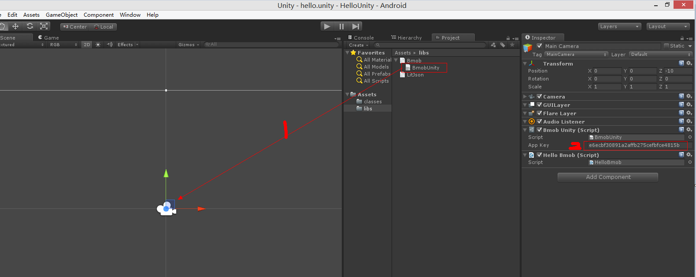

## 案例源码

有关C#相关的源码大家可以移步Github代码仓库：[https://github.com/bmob/bmob-demo-csharp](https://github.com/bmob/bmob-demo-csharp)

## 注册Bmob帐号
在网址栏输入www.bmob.cn或者在百度输入Bmob进行搜索，打开Bmob官网后，点击右上角的“注册”，在跳转页面填入你的姓名、邮箱、设置密码，确认后到你的邮箱激活Bmob账户，你就可以用Bmob轻松开发应用了。


## 网站后台创建应用

登录账号进入bmob后台后，点击后台界面左上角“创建应用”，在弹出框输入你应用的名称，然后确认，你就拥有了一个等待开发的应用。


## 获取应用密钥和下载SDK

选择你要开发的应用，进入该应用


在跳转页面，进入设置/应用密钥，点击复制，即可得到Application ID


获取Application ID后，[点击这里下载Unity SDK](http://www.bmob.cn/site/sdk#unity_sdk)即可。


## 安装BmobSDK

在你的项目Assets根目录下创建"libs"目录，将下载的BmobSDK文件放入该目录下（**Bmob默认使用LitJson进行序列化/反序列化**）。

```shell
$ ls -1 Assets/libs
Bmob.dll
Bmob.dll.meta
LitJson.dll
LitJson.dll.meta

```

**注意**： LitJson有对序列化的部分源码进行修改。

## 初始化BmobSDK

在你的应用程序Camara上附加BmobUnity脚本，同时通过属性窗口将Bmob后台获取的Application ID设置到App Key属性中，如下图所示。



新建一个脚本，获取BmobUnity对象，并添加操作来进行Bmob数据的存储。

```
public class HelloBmob : MonoBehaviour
{

    private BmobUnity Bmob;
    void Start()
    {
		//注册调试打印对象
        BmobDebug.Register(print);
		//获取Bmob的服务组件
        Bmob = gameObject.GetComponent<BmobUnity>();
    }

```

接下来，创建数据表操作类BmobGameObject。数据表操作类有点类似于JavaBean，可以理解为Model模型，该类需要继承自BmobTable，并实现字段的读写方法。这些字段对应Web后台的字段。示例代码如下：

```

	public class BmobGameObject : BmobTable
    {
		//score、playerName、cheatMode是后台数据表对应的字段名称
        public BmobInt score { get; set; }
        public String playerName { get; set; }
        public BmobBoolean cheatMode { get; set; }

		//读字段值
        public override void readFields(BmobInput input)
        {
            base.readFields(input);

            this.score = input.getInt("score");
            this.cheatMode = input.getBoolean("cheatMode");
            this.playerName = input.getString("playerName");
        }

		//写字段值
        public override void write(BmobOutput output, Boolean all)
        {
            base.write(output, all);

            output.Put("score", this.score);
            output.Put("cheatMode", this.cheatMode);
            output.Put("playerName", this.playerName);
        }
    }

```

## 添加一行数据

现在就可以往数据表中添加数据了。首先需要创建BmobGameObject的实例，设置实例值。然后通过调用BmobUnity.Create(String tableName, IBmobWritable data, BmobCallback<CreateCallbackData> callback)方法将数据保存到云端数据库中。

```
    //创建数据对象
	var data = new BmobGameObject();
    //设置值    
    System.Random rnd = new System.Random();
    data.score = rnd.Next(-50, 170);
    data.playerName = "123";
    data.cheatMode = false;

	//添加一行数据
    Bmob.Create(TABLENAME, data, (resp, exception) =>
    {
		if(exception != null){
			print("保存失败, 失败原因为： " + exception.Message);
            return;
        }

        print("保存成功, @" + resp.createdAt);
    });

```


## 获取一行数据

获取数据时，首先需要知道这行数据对应的objectId，然后调用BmobUnity.Get<T>(String tableName, String objectId,  BmobCallback<T> callback)方法获取数据。示例代码如下：

```
		Bmob.Get<BmobGameObject>(TABLENAME, "68ee8131ca", (resp, exception) =>
        {
            if (exception != null)
            {
                print("查询失败, 失败原因为： " + exception.Message);
                return;
            }

            BmobGameObject game = resp;
            print("获取的对象为： " + game.ToString());
        });
```

## 修改一行数据

修改数据时，同样需要知道这行数据对应的objectId，然后调用BmobUnity.Update(String tableName, String objectId, IBmobWritable data, BmobCallback<UpdateCallbackData> callback)方法更新数据。示例代码如下：

```
		BmobGameObject game = new BmobGameObject();
        game.playerName = "pn_123";
		Bmob.Update(TABLENAME, "68ee8131ca", game, (resp, exception) =>
        {
			if (exception != null)
            {
                print("保存失败, 失败原因为： " + exception.Message);
                return;
            }

            print("保存成功, @" + resp.updatedAt);
        });

```
## 删除一行数据

删除数据时，同样需要知道这行数据对应的objectId，然后调用BmobUnity.Delete(String tableName, String objectId, BmobCallback<DeleteResponseData> callback)方法删除数据。示例代码如下：

```
		Bmob.Delete(TABLENAME, "68ee8131ca", (resp, exception) =>
        {
			if (exception != null)
            {
                print("删除失败, 失败原因为： " + exception.Message);
                return;
            }

            print("删除成功, @" + resp.msg);
        });
```

## 源码下载

[快速入门相关源码下载](http://www.bmob.cn/static/Bmob_unity_quickstart.zip "快速入门相关源码下载")


