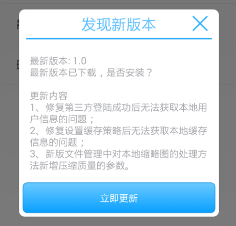
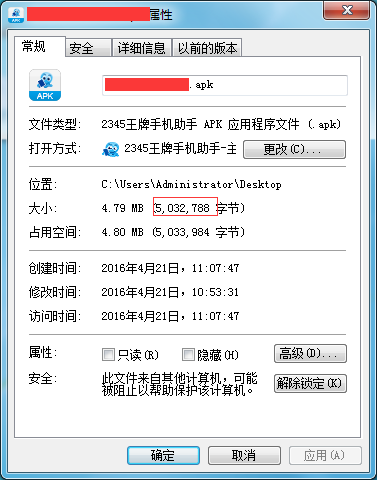
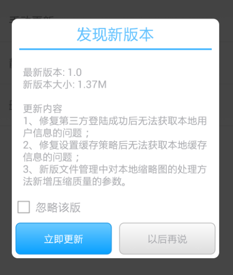

# Android自动更新组件文档

## 快速入门

### 1、添加资源文件

下载SDK提供的res文件夹拷入工程目录下，和工程本身res目录合并。

res文件夹下载地址：[http://www.bmob.cn/static/res.zip](http://www.bmob.cn/static/res.zip)

这里需要注意的是：
1. 请不要随便删除其中的文件。
2. BmobSDK提供的资源文件都以bmob_开头。

### 2、配置AndroidManifest.xml

1.打开AndroidManifest.xml，添加SDK需要的权限到<manifest>标签下：

```xml
<uses-permission android:name="android.permission.WRITE_EXTERNAL_STORAGE"></uses-permission>
<uses-permission android:name="android.permission.ACCESS_NETWORK_STATE"></uses-permission>
<uses-permission android:name="android.permission.INTERNET"></uses-permission>
```

说明：
- android.permission.WRITE_EXTERNAL_STORAGE 权限允许将下载的apk保存到sd卡中。
- android.permission.ACCESS_NETWORK_STATE 权限允许检查网络状态，从而根据不同网络环境决定何种下载策略,务必添加该权限。

2.添加渠道到<application>标签下： 

```xml
<meta-data android:value="Channel ID" android:name="BMOB_CHANNEL"/>
```

说明：`BMOB_CHANNEL`用来标注应用推广渠道，不同渠道可以上传不同更新包，您可以使用20位以内的英文和数字为渠道定名，替换value中的`Channel ID`。如果不添加，将不区分渠道。

3.添加Activity到<application>标签下：

```xml
<activity 
            android:name="cn.bmob.v3.update.UpdateDialogActivity"
		  	android:theme="@android:style/Theme.Translucent.NoTitleBar" >
        </activity>
```

### 3、初始化AppVersion表

一行代码轻松搞定`AppVersion`表（**注意：请务必将该表在WEB端设置为只读模式**）：

SDK提供了初始化自动创建`AppVersion`表的方法，不再需要开发者手动在web端创建。只需要在你使用自动更新功能的地方调用如下代码：

```java
	BmobUpdateAgent.initAppVersion(this);
```

**注：**

**1、initAppVersion方法适合开发者调试自动更新功能时使用，一旦AppVersion表在后台创建成功，建议屏蔽或删除此方法，否则会生成多行记录。**

**2、如果调用了此方法后，在管理后台没有看见AppVersion表生成，建议到手机的应用管理界面`清除该应用的数据，并再次调用该方法`，也可到LogCat中查看与`bmob`相关错误日志。**

**3、如果`2`方法尝试多次之后仍然无效，请`手动创建AppVersion表`，表的各个字段名称请查看下表。**

### 4、调用自动更新接口

最常见的自动更新模式是：当用户进入应用首页后，如果处于wifi环境则检测更新，如果有更新，弹出对话框提示有新版本，用户点选更新开始下载更新。实现的方法是，在应用程序入口Activity里的`OnCreate()`方法中调用如下代码：

```java
public void onCreate(Bundle  savedInstanceState) {
    super.onCreate(savedInstanceState);
    BmobUpdateAgent.update(this);
}
```


1. 考虑到用户流量的限制，目前我们默认在WiFi接入情况下才进行自动提醒。如需要在任意网络环境下都进行更新自动提醒，则请在update调用之前添加以下代码：
```java
BmobUpdateAgent.setUpdateOnlyWifi(false)
```
2. 如果你发现调用update方法无反应，可使用下面`自定义功能`中的`监听检测更新的结果`提到的方法来监听自动更新的结果,具体如下：
```java
BmobUpdateAgent.setUpdateListener(new BmobUpdateListener() {
			
	@Override
	public void onUpdateReturned(int updateStatus, UpdateResponse updateInfo) {
		// TODO Auto-generated method stub
		//根据updateStatus来判断更新是否成功
	}
})
```
#### 强制更新

应用场景：如果应用需要屏蔽旧版本，强制用户必须更新升级到最新版才能继续使用。

SDK中为自动更新方式提供了`强制更新`功能，当开发者开启强制更新功能（即将后台的`AppVersion`表中的isforce字段置为true）时，客户端调用`BmobUpdateAgent.update(context)`方法后，更新对话框只保留“立即更新”按钮且不再支持回退操作。其效果图如下：



#### 忽略版本更新

SDK中为自动更新方式提供了`忽略版本更新`功能，当用户勾选”忽略该版“选项时，再次调用`BmobUpdateAgent.update(context)`则不再出现版本更新对话框。

**注：强制更新和忽略版本更新只支持自动更新方式。**

### 5、上传APK文件或填写apk文件的url地址

初始化AppVersion表成功后，开发者在管理后台的`数据浏览`页中就可以看见AppVersion表了,该表的结构如下：

|字段名称|字段类型|是否必填|字段说明|
|:---|:---|:---|:---|
|update_log|String|是|更新日志|
|version|String|是|版本名称|
|version_i|Number|是|版本号|
|platform|String|是|平台，注意："Android"为安卓平台标示，"ios"为ios平台标示|
|target_size|String|是|Apk文件大小|
|isforce|Boolean|否|	是否强制更新|
|path|File|是/否|Apk文件|
|android_url|String|是/否|apk市场地址（path字段和本字段必填其中一个）|
|channel|String|否|渠道标示|
|ios_url|String|否|iOS app store地址（如果是ios记录一定要填写）|

创建好这个表结构之后就可以新增一些记录，把应用的信息和下载地址（或者上传文件）填写上去，如下图所示：


**注：**

**1、target_size为必填项，是为了解决当apk下载过程中切换网络导致的解析包出现错误问题，请手动填入apk文件的字节大小。可通过鼠标右键apk文件-->属性-->大小（不是占用空间）获取到的target_size值（不需要单位）：**



如上例，只需要在`target_size`字段中填写`5032788`就行。

**2、新添加的数据记录的version_i（对应应用中的version code，如下图）的数值要大于手机中安装的应用的version number，否则无法生效。另外，platform需要根据实际情况填写平台信息。**


**3、新版SDKV3.3.2调用initAppVersion方法后，你会看到AppVersion表的path字段有一个test.apk的文件，其实这个文件是个空的文件，不必过于纠结，将test.apk删除后再上传自己的apk文件即可。**

**4、新版SDKV3.3.4允许下载已上传到应用市场上的apk文件，因此，path和android_url两者填任意一个即可，若都填写，默认优先下载path字段下的apk文件。**

**5、新版SDKV3.3.4新增对update_log字段内容进行文字排版的功能，只需要在分段处加上分隔符`；`即可（UI效果如下图）**

具体格式参考如下范例：1、修复第三方登陆成功后无法获取本地用户信息的问题`；`2、修复设置缓存策略后无法获取本地缓存信息的问题`；`3、修复调用云端逻辑（callEndpoint）方法的成功回调的返回值中含有“results”的问题`；`4、新版文件管理中对本地缩略图的处理方法新增压缩质量的参数。



**6、如果在web后台上传apk文件，然后在使用了v3.4.6之前版本的sdk的应用上调用自动更新功能出现 `解析包出错` 的问题，解决方法如下：**

**请不要上传apk文件到`path`字段，改为`填写apk文件的url地址`到`android_url`字段。**

具体原因请查看 [常见问题](http://docs.bmob.cn/android/autoupdate/index.html?menukey=otherdoc&key=autoupdate#index_常见问题)。

### 6、集成检测

SDK中默认开启了集成检测功能，在调用任意的更新接口后，我们将替您自动检查上述集成过程中2、3两个步骤是否被正确完成。 如果正确完成不会出现任何提示，否则会以如下的toast提示您。

你可以通过调用`BmobUpdateAgent.setUpdateCheckConfig(false)`来禁用此功能。

toast的含义如下：

"Please copy all resources (res/) from SDK to your project!"：请检查是不是把res文件夹下所有的资源文件都放到了工程中。

"Please add Permission in AndroidManifest!"：请检查上述步骤中的相关权限是否正确添加。

"Please add Activity in AndroidManifest!"：请检查上述步骤中的Activity是否正确添加。


## 其他更新方式

除了在快速入门中提到的自动更新之外，Bmob自动更新SDK还支持另外两种场景：手动更新、静默更新。
下面将详细介绍这两种场景的接口及默认行为。

### 手动更新

许多应用的设置界面中都会有检查更新等类似功能，需要用户主动触发而检测更新。它的默认行为基本和自动更新基本一致。它和自动更新的主要区别是：在这种手动更新的情况下，无论网络状况是否Wifi，无论用户是否忽略过该版本的更新，都可以像下面的示例一样在按钮的回调中发起更新检查，代替update(Context context)：
```java
public void onClick(View v) {
    BmobUpdateAgent.forceUpdate(mContext);
}
```

### 静默下载更新

当用户进入应用首页后如果处于wifi环境检测更新，如果有更新，后台下载新版本，如果下载成功，则进行通知栏展示，用户点击通知栏开始安装。静默下载过程中如果wifi断开，则会停止下载。实现的方法是：在应用程序入口Activity里的`OnCreate()`方法中调用如下代码：
```java
public void onCreate(Bundle  savedInstanceState) {
    super.onCreate(savedInstanceState);
    BmobUpdateAgent.silentUpdate(this);
}
```

## 自定义功能

### 恢复默认设置

BmobUpdateAgent.setDefault();

### 设置更新的网络条件

BmobUpdateAgent.setUpdateOnlyWifi（boolean updateOnlyWifi）

注：updateOnlyWifi:true表示只在wifi环境下检测更新，false表示所有环境下均可检测更新

### 监听检测更新的结果

如果开发者想自己处理检测更新的结果，可以按如下步骤，实现更新监听接口，自主处理更新事件：

```java
	BmobUpdateAgent.setUpdateListener(new BmobUpdateListener() {
			
		@Override
		public void onUpdateReturned(int updateStatus, UpdateResponse updateInfo) {
			// TODO Auto-generated method stub
			if (updateStatus == UpdateStatus.Yes) {//版本有更新
				
			}else if(updateStatus == UpdateStatus.No){
				Toast.makeText(ActAutoUpdate.this, "版本无更新", Toast.LENGTH_SHORT).show();
			}else if(updateStatus==UpdateStatus.EmptyField){//此提示只是提醒开发者关注那些必填项，测试成功后，无需对用户提示
				Toast.makeText(ActAutoUpdate.this, "请检查你AppVersion表的必填项，1、target_size（文件大小）是否填写；2、path或者android_url两者必填其中一项。", Toast.LENGTH_SHORT).show();
			}else if(updateStatus==UpdateStatus.IGNORED){
				Toast.makeText(ActAutoUpdate.this, "该版本已被忽略更新", Toast.LENGTH_SHORT).show();
			}else if(updateStatus==UpdateStatus.ErrorSizeFormat){
				Toast.makeText(ActAutoUpdate.this, "请检查target_size填写的格式，请使用file.length()方法获取apk大小。", Toast.LENGTH_SHORT).show();
			}else if(updateStatus==UpdateStatus.TimeOut){
				Toast.makeText(ActAutoUpdate.this, "查询出错或查询超时", Toast.LENGTH_SHORT).show();
			}
		}
	});
    //发起自动更新
	BmobUpdateAgent.update(this);
```

### 监听对话框按键操作

有时候开发者需要知道用户点击了哪个按钮，开发者可设置监听对话框的按钮点击事件。

```java
	//设置对对话框按钮的点击事件的监听
	BmobUpdateAgent.setDialogListener(new BmobDialogButtonListener() {
		
		@Override
		public void onClick(int status) {
			// TODO Auto-generated method stub
			switch (status) {
	        case UpdateStatus.Update:
	            Toast.makeText(ActAutoUpdate.this, "点击了立即更新按钮" , Toast.LENGTH_SHORT).show();
	            break;
	        case UpdateStatus.NotNow:
	        	Toast.makeText(ActAutoUpdate.this, "点击了以后再说按钮" , Toast.LENGTH_SHORT).show();
	        	break;
	        case UpdateStatus.Close://只有在强制更新状态下才会在更新对话框的右上方出现close按钮,如果用户不点击”立即更新“按钮，这时候开发者可做些操作，比如直接退出应用等
	            Toast.makeText(ActAutoUpdate.this, "点击了对话框关闭按钮" , Toast.LENGTH_SHORT).show();
	            break;
	        }
		}
	});
```

**注：UpdateStatus列表**

1. UpdateStatus.TimeOut    =-1：查询出错或超时
2. UpdateStatus.Yes        = 0：有更新
3. UpdateStatus.No         = 1：没有更新
4. UpdateStatus.IGNORED    = 3：该版本已被忽略更新
5. UpdateStatus.EmptyField = 2：字段值为空，请检查以下内容：
- 是否已填写target_size目标apk大小（以字节为单位）；
- path或者android_url两者是否必填其中一项（若两者都填写，则默认下载path字段下的apk文件）
6. UpdateStatus.ErrorSizeFormat = 4：请检查target_size填写的格式，请使用file.length()方法获取apk大小
7. UpdateStatus.Update     =6： 代表点击的是“立即更新”
8. UpdateStatus.NotNow     =7： 代表点击的是“以后再说”
9. UpdateStatus.Close      =8： 代表关闭对话框-->只有在强制更新状态下才会在更新对话框的右上方出现close按钮,如果用户不点击”立即更新“按钮，这时候开发者可做些操作，比如直接退出应用等

## 常见问题
 
一、** 为什么上传新的apk文件后，使用 `v3.4.6以前版本的SDK开发的旧应用` 的自动更新功能会出现 `解析包出错` 问题？**
 
1、原因：

自4月13日上线CDN文件服务以来，通过Web后台上传的apk文件都会自动上传到CDN服务提供商那里，而v3.4.6以前版本的SDK中的自动更新功能中得到`用于下载的url地址会将Bmob原有的文件域名拼接到BmobFile的url前面`。

因此，最终拼接成的用于下载的地址是类似这样的：http://file.bmob.cn/http://bmob-cdn-82.b0.upaiyun.com/2016/04/20/文件名.apk，由此导致 `解析包出错`。

2、**解决方法：**
	
**不要上传apk文件到`AppVersion`表的`path`字段，改为填写url地址到`AppVersion`表的`android_url`字段**，以此来恢复旧应用的自动更新功能。

其中，`android_url`可以是以下两种之一：

1）、`各大应用市场的应用下载地址`
2）、`上传新的apk文件到bmob的其他表的文件字段中，然后通过getFileUrl(context)获取到的url地址`


二、 **为什么调用`BmobUpdateAgent.update(this)`方法后没有弹出更新对话框？**

请仔细检查以下几方面：

1）、如果是通过`手动方法`在后台创建的AppVersion表的话，则仔细对照文档检查各个字段的名称是否正确填写，注意大小写;

2）、`AndroidManifest.xml`中的的`android:versionCode`的值是否比后台的`AppVersion`表中填写的`version_i`的值`小`;

3）、`target_size`的值是否正确填写，填写的是apk的字节大小，没有单位，例如：很多开发者填写的是'x.xxM',这个格式是错误的;

4)、`AndroidManifest.xml`中的`BMOB_CHANNEL`的值是否和后台的`AppVersion`表中填写的`channel`的值`相等`。

```java
 <!-- 设置应用渠道，如果应用不需要区分渠道，则建议删除此行 -->
<meta-data android:name="BMOB_CHANNEL" android:value="bmob"/>

```
## 案例源码

这里我们提供了一个使用BmobSDK自动更新功能的实例程序供大家参考。下载地址如下：[https://github.com/bmob/bmob-android-demo-autoupdate](https://github.com/bmob/bmob-android-demo-autoupdate)

