## 简介

libGDX是一个开源的游戏框架，其优势是兼容性非常好，可兼容多种平台系统（Windows、Linux、Max OS X、Java Applet、Javascript/WebGL），包括移动系统Android和iOS，并且使用的是最为广泛的java语言来进行开发，因此前景相当不错。最近有不少开发者问到关于如何配合使用BmobSDK和libGDX来开发ios游戏，这其中大部分都是只接触过Android的开发者（引擎使用java开发的原因），对于ios不熟悉，因此在使用的过程中会遇到一些问题。因此，本文将详细地讲解如何搭建开发环境，并介绍如何在libGDX如何使用BmobSDK进行iOS游戏的开发。

## 开发环境搭建

搭建开发主要有以下两大部分

1. RoboVM的搭建
2. libGDX的环境搭建


### RoboVM的搭建

#### RoboVM简介
以下文字摘自百度百科

```
RoboVM 编译器可以将 Java 字节码翻译成 ARM 或者 x86 平台上的原生代码，应用可直接在 CPU 上运行，无需其他解释器或者虚拟机。
RoboVM 同时包含一个 Java 到 Objective-C 的桥，可像其他 Java 对象一样来使用 Objective-C 对象。大多数 UIKit 已经支持，而且将会支持更多的框架。
```
RoboVM类似于Android的jni，使用它就可以使用Java来调用Object-C对象，用Java进行iOS开发。


#### RoboVM搭建
1.安装Java JDK，注意需要1.7以上才支持RoboVM

2.下载eclipse

3.安装RoboVM插件，具体步骤如下：

1)进入 `help/install New Software`

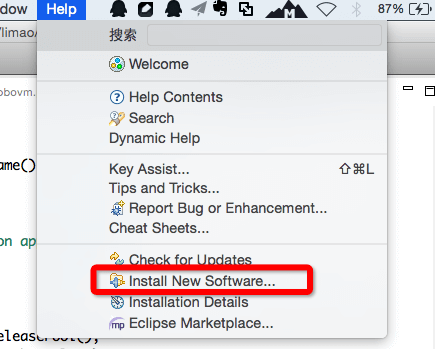

2)输入 `http://download.robovm.org/eclipse/` 下载插件，完成后重启即可


**注**：在[RoboVM官方搭建文档](http://docs.robovm.com/getting-started/eclipse.html)中也有如何安装RoboVM的教程，具体的安装步骤以及安装参数（如下载链接）请以官方教程为准。

4.安装完成后，重启eclipse,进入File/New/Project即可看到RoboVM工程的创建图标，如果你真是想用java来开发iOS应用，那么进行到这一步已经大功告成了。

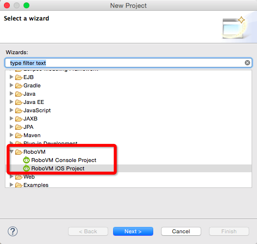

### libGDX环境搭建和工程创建

1.进入[libGDX官网](http://libgdx.badlogicgames.com/download.html)下载libGDX工程生成工具，该工具是一个jar应用。

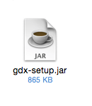

2.进入gdx-setup，设置好相应的参数，并选好需要开发的平台的子项目即可。此处选取了ios、desktop及html三个平台，需要开发android平台的还需要在Android子项目处勾选上。

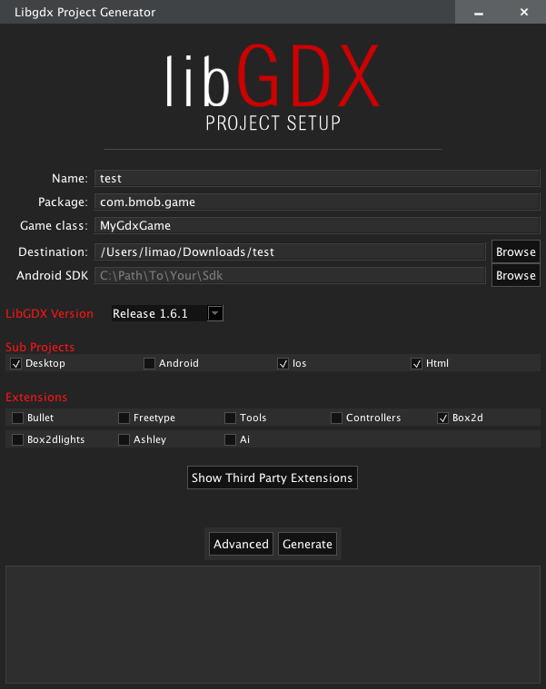

3.点击生成，第一次生成需要下载一些文件，时间会比较久，当出现 `BUILD SUCCESSFUL` 提示时，说明项目已经创建好了，如下图所示。

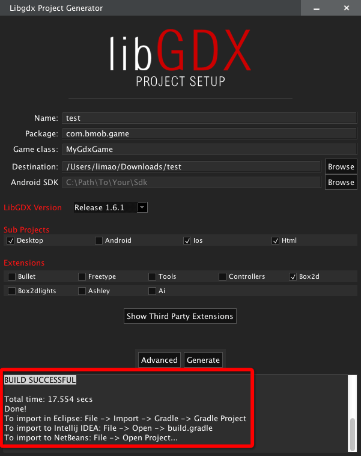

4.在上图中我们可以看到生成工程后，会提示在不同的IDE要怎么打开，在eclipse中打开是需要以gradle工程来打开，这需要我们安装Gradle插件，我们可以进入 `help/Eclipse Marketplace` 搜索该插件进入安装（别问我为什么安装RoboVM时为什么不用这个方法，因为搜索不到啊）

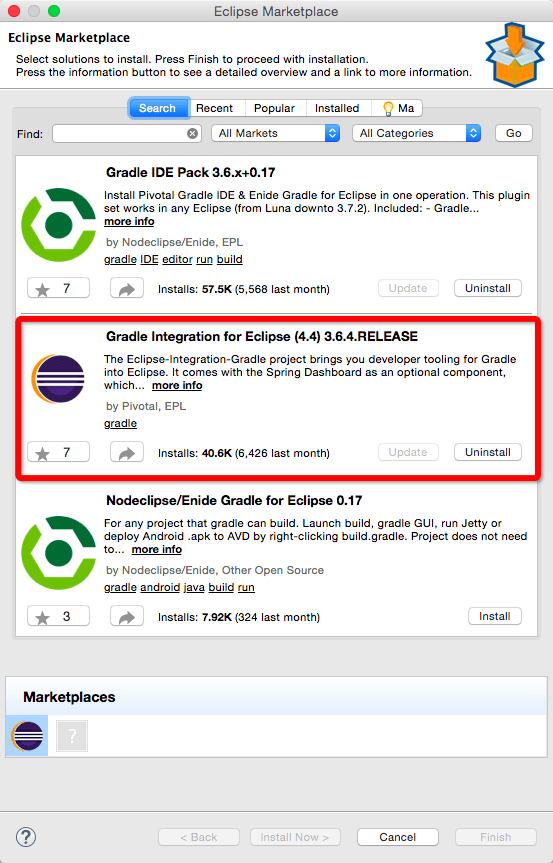

5.安装完成后，进 `File/Import/Gradle/Gradle Project`，导入刚刚生成的工程，注意提示，导入前需要先点击 `Build Model` 按键。

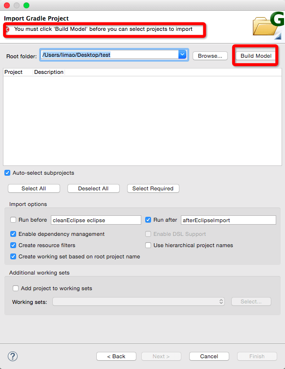

6.导入后的可以看到在 `Package Explorer` 中生成了以下工程,其中core工程用以编写与平台无关的代码，而以对应平台名结尾的工程则是编写对应平台的逻辑代码，以项目名为名的工程（本文中为test）主要存放一些公共环境的配置代码。

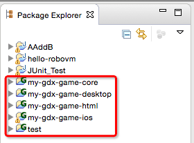

7.建好工程后可以按下图所示，跑一下工程，查看工种是否搭建成功。模拟器可以选择iPad或者iPhone,第一次运行时由于需要编译一些公共包，时间会比较久。


运行后的效果图

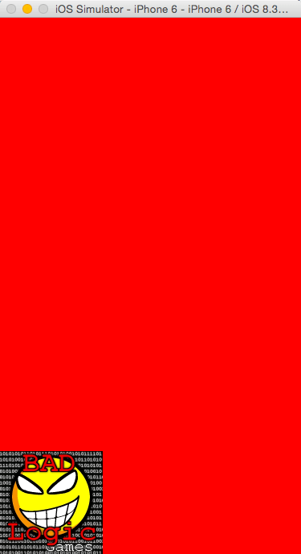

### 使用BmobSDK进行iOS开发

按照教程完成上述的工程创建后就可以进行开发了。下面将讲述如何使用BmobSDK.framework进行开发。

1.下载[BmobSDK iOS版](http://www.bmob.cn/site/sdk)

2.导入BmobSDK.framework,如下图所示，直接将文件拖动至ios子项目的build目录下。

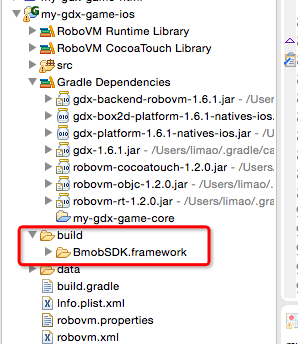

3.进入robovm.xml添加以下代码，声明相应的依赖库。

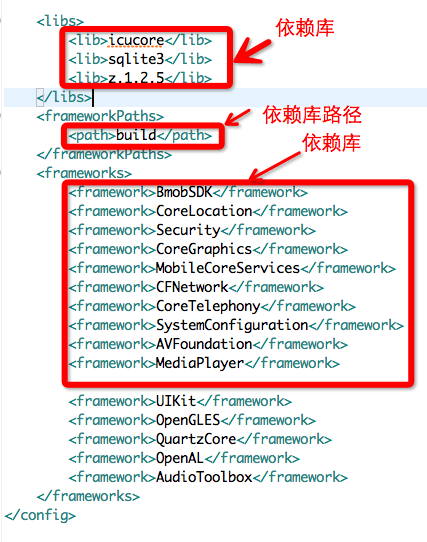

4.编写绑定文件。如果希望知道如何绑定，可以参考博客[libgdx与Robovm绑定的坑](http://blog.csdn.net/qq634416025/article/details/35543715)。当然，为了尽快体验一下效果，我们可以直接使用该博客的作者`爱学习的坏蛋`写好的一个绑定库[https://github.com/tianqiujie/robovm-ios-bindings](https://github.com/tianqiujie/robovm-ios-bindings)，这里面有已经绑定好的BmobSDK库，我们直接将这些文件加入到工程即可。如下图

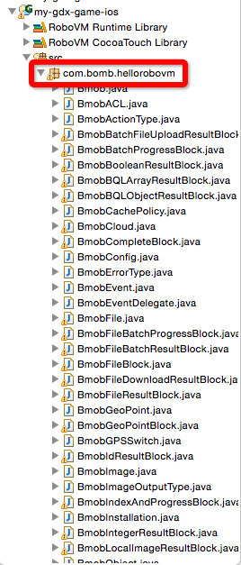

5.接下来，我们还需要到[Bmob官网](http://www.bmob.cn)注册一个帐号并在后台创建应用，并将App Key复制下来。如下图

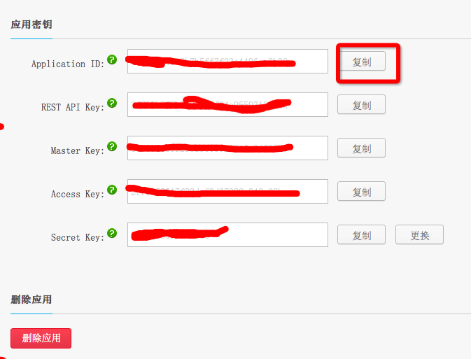

6.至此，准备工作已经全部完成，我们尝试写一段代码以测试项目是否可以工作。在IOSLauncher.java文件中的protected IOSApplication createApplication() 方法中添加以下代码

```
    @Override
    protected IOSApplication createApplication() {
        IOSApplicationConfiguration config = new IOSApplicationConfiguration();
        //注册应用
    	Bmob.registerWithAppKey("4bf74404e49b7b5ff7f23c4496ee2b36");
    	//构造需要添加的记录
        final BmobObject gameScore = new BmobObject("GameScore");
        gameScore.setObject(new NSString("小明"), "playerName");
        gameScore.setObject(NSNumber.valueOf(100), "score");
        gameScore.setObject(NSNumber.valueOf(true), "cheatMode");
        //保存记录
        gameScore.saveInBackgroundWithResultBlock(new BmobBooleanResultBlock() {
			
			@Override
			public void invoke(boolean isSuccessful, NSError error) {
				// TODO Auto-generated method stub
				if(isSuccessful){
					System.out.println("success");
					//获取创建成功后的BmobObject的 objectId
					System.out.println(gameScore.getObjectId());
				}else{
					System.out.println(error.getCode()+error.getDomain());
				}
			}
		});
    	
        return new IOSApplication(new MyGdxGame(), config);
    }
```

7.运行工程，可以看到以下log。


进入Bmob后台，可以看到已经生成了一条数据库记录。

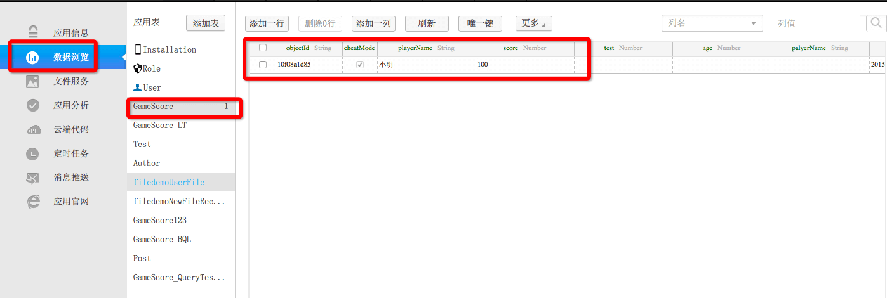

## 总结
本教程主要讲解如何搭建libGDX开发环境，并结合BmobSDK来进行开发。如果在对文章有任何疑问或者发现错误之处，欢迎提出。


