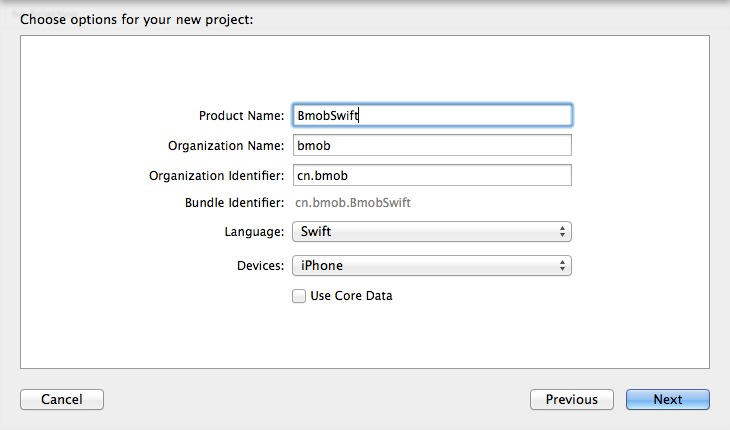
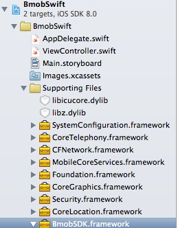

# Swift项目中使用BmobSDK

本文档的目的是为了方便大家在Swift工程中使用BmobSDK，实现应用的快速开发。下面介绍怎么在 Swift 工程中使用 BmobSDK。

## 在Bmob上创建应用
关于如何创建应用，具体请参照[快速入门](http://docs.bmob.cn/ios/faststart/index.html?menukey=fast_start&key=start_ios)

## 创建Swift项目
使用Xcode6创建一个新的Single View Application


Language选择Swift



## 设置BmobSDK
从官网下载最新的[BmobSDK](http://www.bmob.cn/sdk/Bmob_SDK_iOS_v1.4.1.zip),解压导入项目。

添加依赖库文件:
- Foundation.framework
- CoreLocation.framework
- Security.framework
- CoreGraphics.framework
- MobileCoreServices.framework
- CFNetwork.framework
- CoreTelephony.framework
- SystemConfiguration.framework
- AVFoundation.framework
- MediaPlayer.framework
- libz.1.2.5.dylib
- libicucore.dylib
- libsqlite3.dylib

添加完成后，应该像这个样子



或者开发者也可以通过cocoapods来进行管理
Podfile 文件的内容可以写成

```
target "xxxxxx" do
platform:ios,"8.0"
use_frameworks!

pod 'BmobSDK','~>1.7.0'


end

```

## 创建桥接头文件(Bridging Header)

想要在Swift中使用Objective-C 的类和方法的话，需要创建一个.h 头文件，把你想在 Swift 中使用的 Objective-C 的头文件都包含进来。创建桥接头文件的方法有两种：可以自己手动创建一个桥接头文件并在项目配置项里面进行设置，也可以使用更快捷的方式，在你的项目里创建一个无用的 Objective-C 类文件（如：test.m），Xcode 将询问你是否要创建一个桥接头文件：


完成之后，你就可以删除test.m文件了,然后在 BmobSwift-Bridging-Header.h 中引入

```
#import <BmobSDK/Bmob.h>
```

## 测试CURD功能

在AppDelegate.swift注册申请的AppKey

```
    func application(application: UIApplication, didFinishLaunchingWithOptions launchOptions: [NSObject: AnyObject]?) -> Bool {
        // Override point for customization after application launch.

        Bmob.registerWithAppKey("xxxxx")

        return true
    }
```

在ViewController.swift 中添加函数

```
//创建方法
    func save(){
        let gamescore:BmobObject = BmobObject(className: "GameScore")
        gamescore.setObject("Jhon Smith", forKey: "playerName")
        gamescore.setObject(90, forKey: "score")
        gamescore.saveInBackgroundWithResultBlock { (isSuccessful, error) in
            if error != nil{
                print("error is \(error.localizedDescription)")
            }else{
                print("success")
            }
        }
    }
```

然后在viewDidLoad函数中调用

```
override func viewDidLoad() {
        super.viewDidLoad()
        // Do any additional setup after loading the view, typically from a nib.
        save()
    }
```

现在就可以在WEB后台查看是否创建成功，如下图所示。


```
//查询方法
func queryUsers()  {
        let query:BmobQuery = BmobUser.query()
        query.orderByDescending("createdAt")
        query.findObjectsInBackgroundWithBlock { (array, error) in
            for i in 0..<array.count{
                let obj : BmobUser = array[i] as! BmobUser
                print("object id \(obj.objectId),username \(obj.username)")

            }
        }
    }

```

```
//更新方法
func update() {
        let  gamescore:BmobObject = BmobObject(outDatatWithClassName: "GameScore", objectId: "f3a82207ed")
        gamescore.setObject(91, forKey: "score")
        gamescore.updateInBackgroundWithResultBlock { (isSuccessful, error) in
            if error != nil{
                print("error is \(error.localizedDescription)")
            }else{
                print("success")
            }
        }
    }
```

```
//删除方法
    func deleteGameScore()  {
        let  gamescore:BmobObject = BmobObject(outDatatWithClassName: "GameScore", objectId: "4faf28f4dd")
        gamescore.deleteInBackgroundWithBlock { (isSuccessful, error) in
            if error != nil{
                print("error is \(error.localizedDescription)")
            }else{
                print("success")
            }
        }
    }
    
 ```


## 案例源码

[点击下载源码](https://github.com/bmob/bmob-ios-demo/blob/master/SwiftDemo.zip "点击下载源码")

