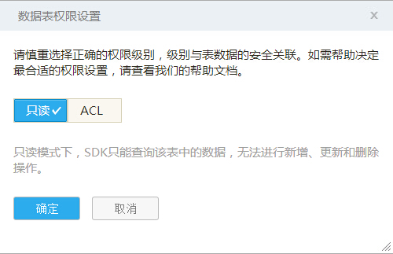

## 简介

数据安全是软件系统中最重要的组成部分，为了更好的保护应用数据的安全，Bmob在软件架构层面提供了传输层面、应用层次、表层次、ACL（Access Control List：访问控制列表）、角色管理（Role）、发布层次等不同粒度的权限控制的方式，确保用户数据的安全。

## 传输层面

Bmob SDK对数据进行了加密封装，采用`requestId` + `timestamp` + `Application Key` 的一次性对称加密算法和服务端主动防御的技术，确保数据在传输过程中能够不被Fiddler、Wireshark等抓包工具恶意抓取进行分析破坏。

## 应用层次

在创建应用时Bmob会自动给每个应用分配三个Key，分别是Application Key, 、REST API Key 、Master Key（这些Key可以在开发者后台对应应用的“应用密钥”中找到）。

- Application Key 应用程序Key：
主要是iOS/Android/Unity/Cocos2d-x等SDK开发测试和发布时，用于请求、数据的凭证。

- REST API Key：
主要是REST API接口开发测试和发布时，用于请求数据的凭证。

- Master Key：
超级权限Key，开发者内部使用，使用此Key请求数据，表、对象、ACL等其他层次的权限不起作用（**请妥善保管Master Key，不要泄露**）。

## 表层次
Bmob在表权限管理方面可以设置该表只读还是使用ACL的权限（设置方法：登录开发者后台->选择某个应用->数据浏览->选择某个需要设置权限的表->点击“更多”->点击“权限设置”，如下图）。

表的只读权限设置非常有价值，比如，你用Bmob开发了一款新闻应用，或者是一个广告墙应用，或者是有排行榜功能的某款游戏，你肯定不希望黑客或者竞争对手通过破解你的应用获取了App Key就可以做出毁灭性破坏。换言之，你希望这些表是只读的，这时候，Bmob的表只读权限的价值就体现出来了。

此外，由于默认情况下，SDK可以创建任何表，因此Bmob还提供了一个功能：是否允许SDK动态建表。这在一定程度上也给破坏者带来了破坏的困难。设置的方法如下图所示：

## ACL和角色

最灵活的方法是通过ACL和角色，它的思路是每一个对象有一个用户和角色的列表，以及这些用户和角色拥有什么样的许可权限。

大多数应用程序需要对不同的数据进行灵活的访问和控制，这就可以使用Bmob提供的ACL模式来实现。例如：

- 对于私有数据，读写权限可以只局限于数据的所有者。
- 对于一个论坛，会员和版主有写的权限，一般的游客只有读的权限。
- 对于日志数据只有开发者才能够访问，ACL可以拒绝所有的访问权限。
- 属于一个被授权的用户或者开发者所创建的数据，可以有公共的读的权限，但是写入权限仅限于管理者角色。
- 一个用户发送给另外一个用户的消息，可以只给这些用户赋予读写的权限。

用Bmob SDK，你可以对这些数据设置一个默认的ACL，这样，即使黑客反编译了你的应用，获取到Application Key，也仍然无法操作和破坏你的用户数据，确保了用户数据的安全可靠。而作为开发者，当你需要对这些数据进行管理时，可以通过超级权限Key（Master Key）进行。

## 发布层次

当APP进入发布阶段，你可以做更多的工作，防止某些不法人士破解了你的APP，获取Application KEY，而随意更改里面的数据。需要做的事情非常简单，你只需要进入到这个APP的Bmob后台，依次点击“应用设置->安全认证”，将APP的签名/Bundle ID信息填写在里面，就可以确保数据的安全。如下图：

如果你的APP已经处于发布状态，也开启了安全认证，那么，当你需要对这个APP进行调试时，要把调试时的网络IP加到IP白名单上面。这样的话，这个IP就能够绕过安全认证进行操作。有点繁琐，但为了确保你的数据安全，Bmob后端云建议你进行相应的操作。