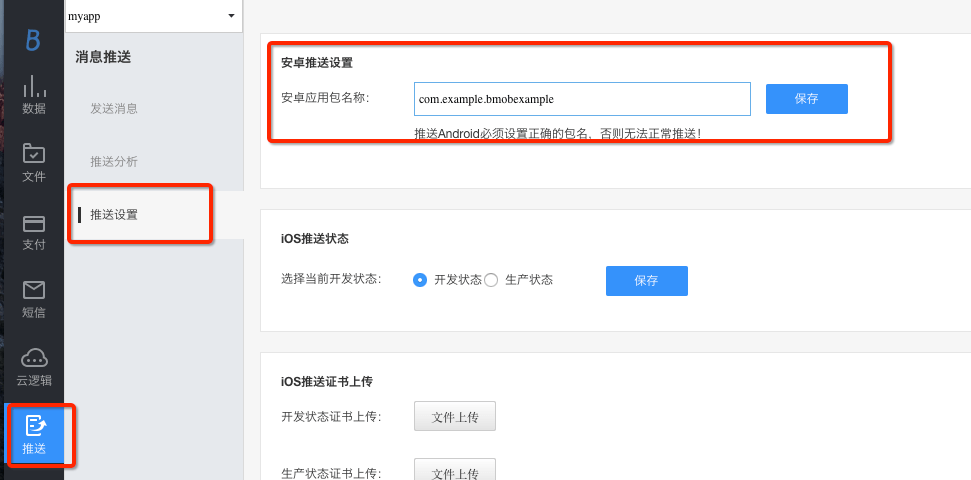

## 下载 

将下载的zip压缩包进行解压，然后将它放在你项目根目录下的"libs"目录中。


## 添加权限

在您的应用程序AndroidManifest.xml文件中添加相应的权限：

```xml
	<!-- BmobSDK所需的权限 -->
    <uses-permission android:name="android.permission.INTERNET" />
    <uses-permission android:name="android.permission.ACCESS_NETWORK_STATE" />
    <uses-permission android:name="android.permission.ACCESS_WIFI_STATE" />
    <uses-permission android:name="android.permission.READ_PHONE_STATE" />
    <uses-permission android:name="android.permission.WRITE_EXTERNAL_STORAGE" />
    <!--推送所需的权限-->
    <uses-permission android:name="android.permission.RECEIVE_USER_PRESENT" />
    <uses-permission android:name="android.permission.RECEIVE_BOOT_COMPLETED" />
```

## 注册服务

在您的应用程序AndroidManifest.xml文件中注册BmobPush SDK运行所需的推送服务和消息接收器：
```xml
<service
   	android:label="PushService"
    android:name="cn.bmob.push.lib.service.PushService"
    android:process="cn.bmob.push"
    android:exported="true">
        <intent-filter>
            <action android:name="cn.bmob.push.lib.service.PushService"/>
        </intent-filter>
</service>
        
<receiver android:name="cn.bmob.push.PushReceiver">
    <intent-filter><!--优先级加最高-->
          <!-- 系统启动完成后会调用 -->
          <action android:name="android.intent.action.BOOT_COMPLETED"/>               
          <!-- 解锁完成后会调用 -->
          <action android:name="android.intent.action.USER_PRESENT"/>
          <!-- 监听网络连通性 -->
          <action android:name="android.net.conn.CONNECTIVITY_CHANGE"/>               
    </intent-filter>
</receiver>

<!-- 第四部中创建的消息接收器，在这里进行注册 -->
<receiver android:name="your.package.MyPushMessageReceiver">
     <intent-filter >
          <action android:name="cn.bmob.push.action.MESSAGE"/>
     </intent-filter>
</receiver>
```

## 创建接收器

在你的应用程序中创建一个消息接收器。

Push消息通过`action=cn.bmob.push.action.MESSAGE`的Intent把数据发送给客户端`your.package.MyPushMessageReceiver`,消息格式由应用自己决定，PushService只负责把服务器下发的消息以字符串格式透传给客户端。

`your.package.MyPushMessageReceiver`代码示例如下：

```java
public class MyPushMessageReceiver extends BroadcastReceiver{

	@Override
	public void onReceive(Context context, Intent intent) {
		// TODO Auto-generated method stub
		if(intent.getAction().equals(PushConstants.ACTION_MESSAGE)){
			Log.d("bmob", "客户端收到推送内容："+intent.getStringExtra(PushConstants.EXTRA_PUSH_MESSAGE_STRING));
		}
	}
	
}
```

## 启动推送服务

在你的应用程序主Activity中调用如下方法：
```java
	// 初始化BmobSDK
	Bmob.initialize(this, "你的AppKey");
	// 使用推送服务时的初始化操作
	BmobInstallation.getCurrentInstallation(this).save();
	// 启动推送服务
	BmobPush.startWork(this);
```
代码中的"你的AppKey"就是你在Bmob后台中创建的应用程序的AppKey，如果你不知道这是什么，可以参考[快速入门文档](http://docs.bmob.cn/android/faststart/index.html?menukey=fast_start&key=start_android "Android快速入门")中的注册Bmob账号部分。

## 在web端进行推送设置

在应用面板-->消息推送-->推送设置界面中填写包名进行保存。


## 在web端推送消息

完成以上步骤后，你可以运行应用程序，从web推送一条消息给客户端。


在后台推送消息给Android和iOS两个平台的时候，有一些需要注意的：
1、由于Android和iOS的提送机制不同，iOS要经过APNS，Android的推送完全是走Bmob的长连接服务，为兼容这个问题，如果你选择发送格式为“json”格式时，需要添加APNS兼容头部（见下面json的aps部分），推送内容格式如下：

```
{
	"aps": {
	"sound": "cheering.caf", 
	"alert": "这个是通知栏上显示的内容", 
	"badge": 0 
	}, 
	"xx" : "json的key-value对，你可以根据情况添加更多的，客户端进行解析获取", 
}
```

其中，sound是iOS接收时的声音，badge是iOS通知栏的累计消息数。

2、如果你选择发送格式为“text”时，推送内容为“推送消息测试。。。。”，Bmob会自动添加aps部分发送给APNS，，相当于自动生成如下的json格式的推送内容：

```
{
	"aps": {
		"alert": "推送消息测试。。。。", 
	}
}
```
同时，也会发送给Android端，相当于自动生成如下的json格式的推送内容：

```
{
	"alert" : "推送消息测试。。。。", 
}
```

3、如果只是发送给Android端，大家可以自定义json格式的数据。

4、由于iOS的APNS的推送的大小是有限制的，默认最多256bytes，因此,如果你需要跨平台互通的话，需注意推送的内容不要太长。

5、想要更多了解Bmob的推送格式的朋友，如即时聊天，可以查看我们在问答社区中的回答：[http://wenda.bmob.cn//?/question/204](http://wenda.bmob.cn//?/question/204)

## 源码下载

为了更好的让开发者朋友正确的集成和使用Bmob推送功能，我们还提供了一个关于Bmob推送功能的简单Demo以供大家参考，有需要的朋友可以到如下地址进行源码的下载。[https://github.com/bmob/bmob-android-demo-push](https://github.com/bmob/bmob-android-demo-push)

